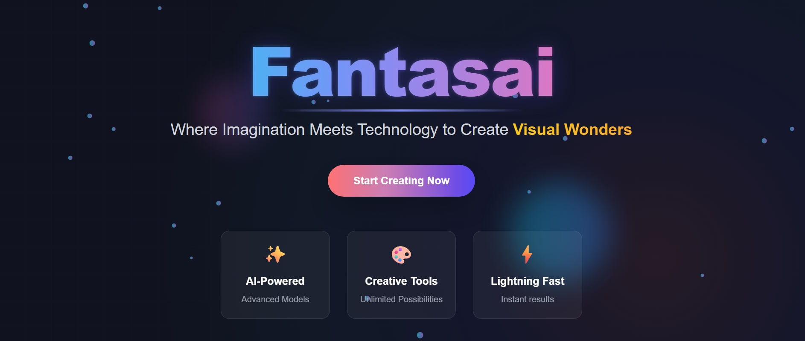
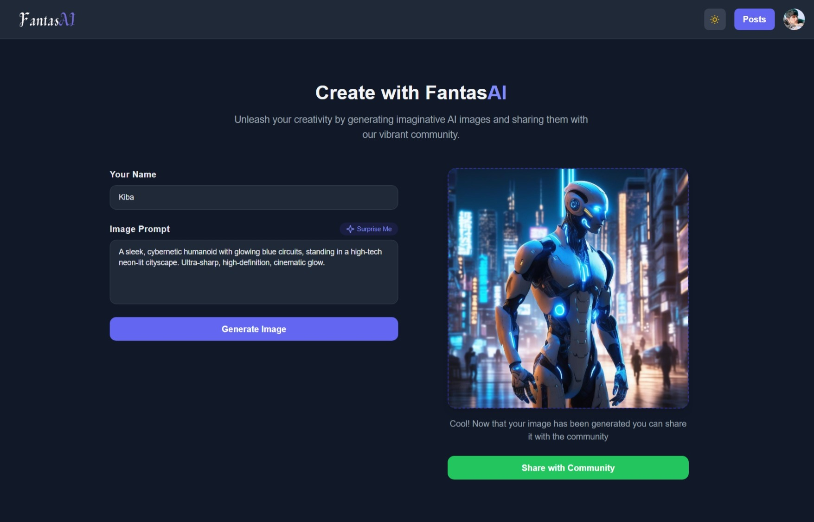
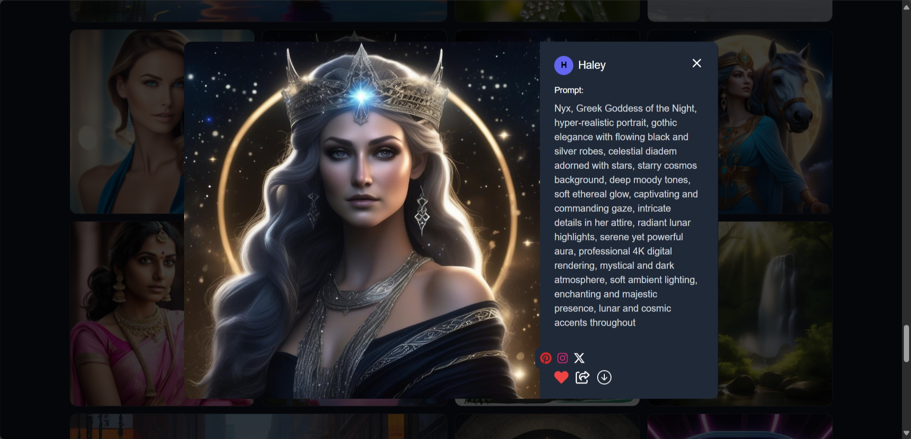
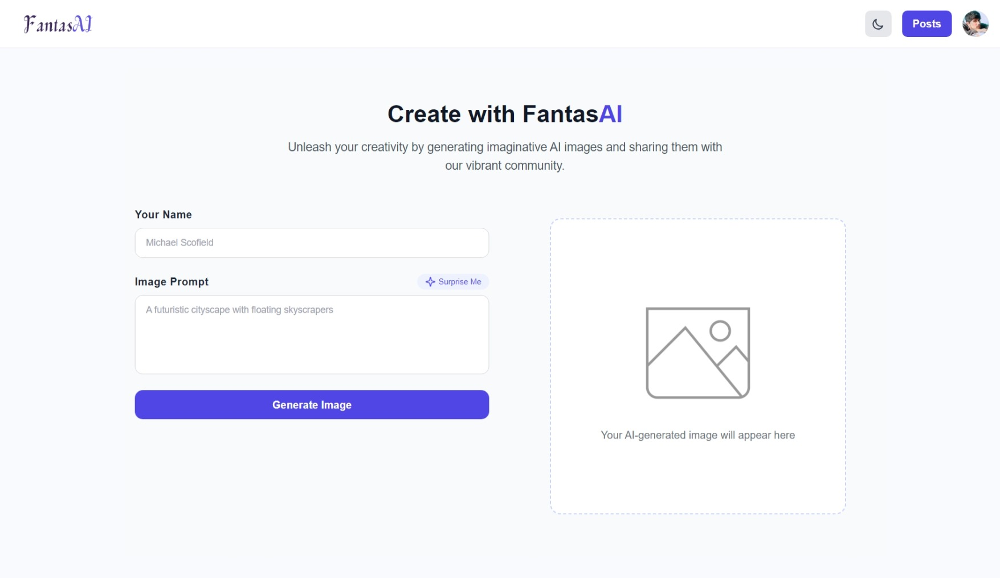

# Fantasai - AI-Powered Image Generation App



Fantasai is an intuitive AI image generation application that transforms your text prompts into stunning visual art. Powered by FLUX.1, a state-of-the-art image generation model, Fantasai makes creative image generation accessible to everyone.

## ✨ Features

- **AI-Powered Image Generation**: Transform text prompts into visually stunning images using state-of-the-art AI model
- **User-Friendly Interface**: Visually appealing and intuitive design for seamless user experience
- **Community Gallery**: Explore and get inspired by images created by other users
- **Modern Authentication**: Sign in with google with one click or sign up with your email
- **Cross-Platform**: Available on web, iOS, and Android
- **Share Functionality**: Easily share your creations on the Fantasai community or on other social media platforms
- **Dark/Light Theme**: Customize your visual experience with dark and light modes

## 📱 Screenshots

### Image Generation



### Community Gallery


### Modal window



### Light Theme



## 🧰 Tech Stack

### Frontend

- React.js
- Vite
- TailwindCSS
- React Router
- Framer Motion
- Firebase

### Backend

- Express.js and Node.js
- MongoDB
- Mongoose
- JWT Authentication
- Flux.1
- Cloudinary

## 🚀 Getting Started

### Installation

#### Frontend (React + Vite)

```bash
# Clone the repository
git clone https://github.com/kiranreigns/Fantasai.git
cd Fantasai/frontend

# Install dependencies
npm install

# Start development server
npm run dev
```

#### Backend (Express.js)

```bash
# Navigate to backend directory
cd Fantasai/backend

# Install dependencies
npm install

# Start development server
npm run dev

# Start server
npm start
```

### Environment Variables

Create a `.env` file in the backend directory with the following variables:

```
MONGODB_URL=your_mongodb_connection_string
JWT_SECRET=your_jwt_secret
NVDIA_FLUX_API_KEY=your_flux_api_key
CLOUDINARY_CLOUD_NAME=your_cloudinary_cloud_name
CLOUDINARY_API_KEY=your_cloudinary_api_key
CLOUDINARY_API_SECRET=your_cloudinary_api_secret
```

Create a `.env` file in the frontend directory with:

```
VITE_API_KEY=your_firebase_api_key
VITE_AUTH_DOMAIN=your_firebase_auth_domain
VITE_PROJECT_ID=your_firebase_project_id
VITE_STORAGE_BUCKET=your_firebase_storage_bucket
VITE_MESSAGING_SENDER_ID=your_firebase_message_sender_id
VITE_APP_ID=your_firebase_app_id
```

## 🤝 Contributing

Contributions are welcome! Please feel free to submit a Pull Request.

1. Fork the repository
2. Create your feature branch (`git checkout -b feature/amazing-feature`)
3. Commit your changes (`git commit -m 'Add some amazing feature'`)
4. Push to the branch (`git push origin feature/amazing-feature`)
5. Open a Pull Request

## 📬 Contact

- Email: kiran01001011@gmail.com
- Linkedin: [www.linkedin.com/in/kiran-s-428404249](www.linkedin.com/in/kiran-s-428404249)
- Website: [fantasai-app.com](https://fantasai-app.com)

---
